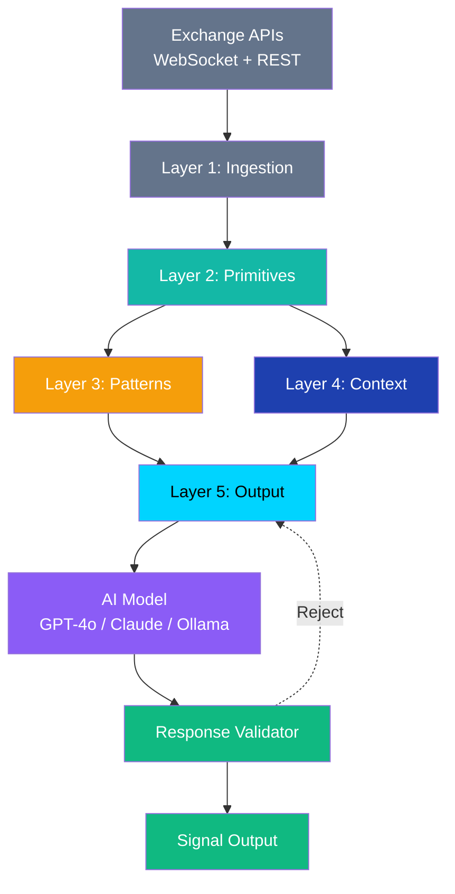
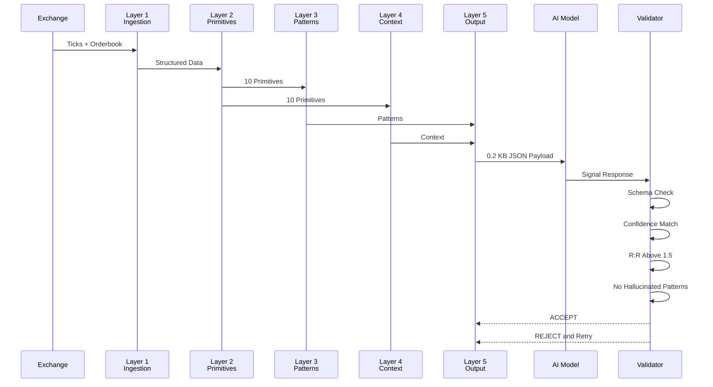
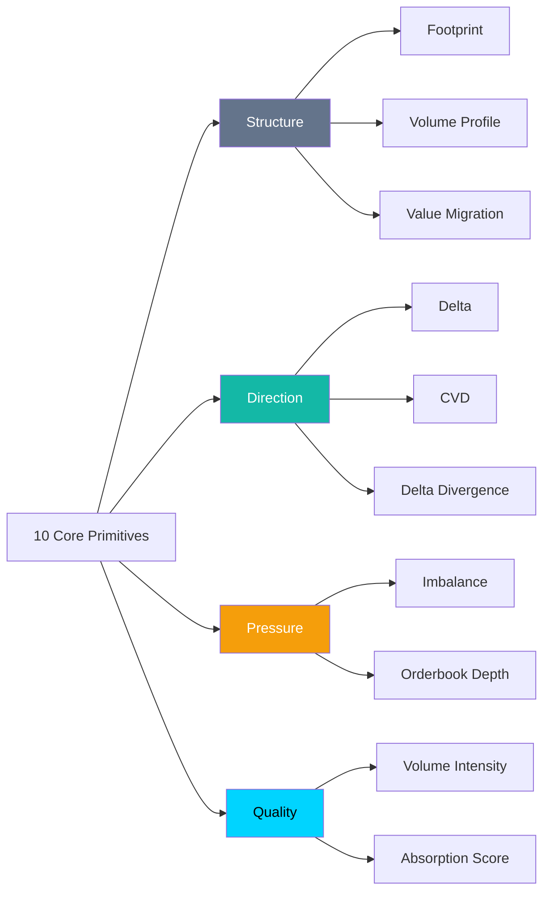
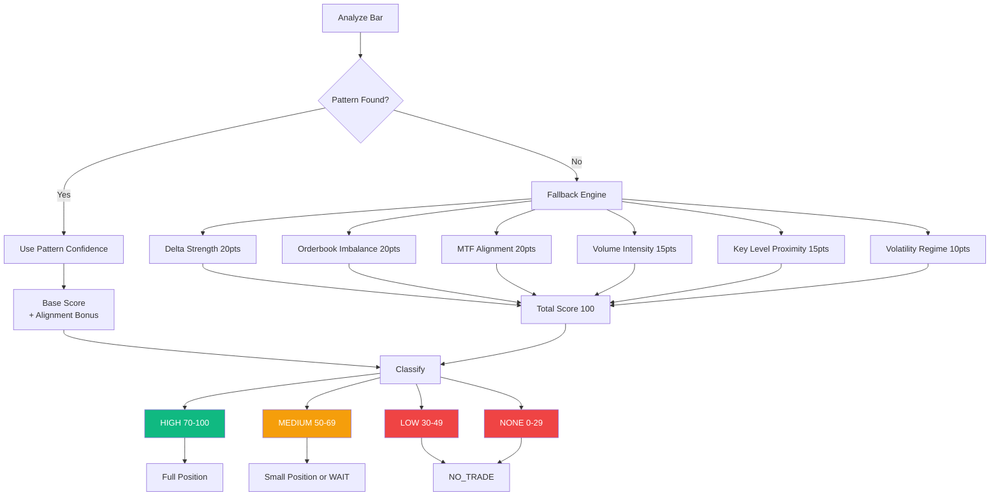
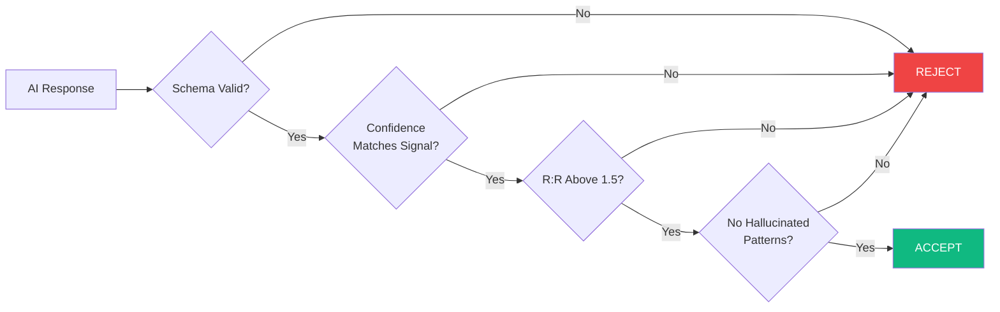

# OrderFlow Engineer

**Order Flow Analysis Tool Engine**

Transform raw market microstructure data into structured, AI-ready trading signals.

[](https://trade.pkay.fun/docs)

[](https://www.python.org/downloads/)
[](LICENSE)
[](https://github.com/Sultanrayan/orderflow-tooling)
[](https://trade.pkay.fun/docs)

---

## Overview

OrderFlow AI is an AI-powered order flow analysis engine that transforms raw market microstructure data into structured, AI-ready signals.

The engine collects tick-level data and order book depth, computes order flow primitives, detects patterns, builds market context, and produces a compact JSON payload optimized for Large Language Models. The model responds with a trading signal, a confidence score, a setup, and invalidation levels — validated against a strict schema before it is accepted.

**`NO_TRADE` and `WAIT` are valid outcomes: the engine never forces a signal.**

---

## Architecture



### Layer Breakdown

| Layer | Responsibility |
|-------|----------------|
| **1. Ingestion** | WebSocket trades and depth, REST candles, normalizing, ring buffer, timestamp sync |
| **2. Primitives** | 10 primitives: footprint, volume profile, value migration, delta, CVD, delta divergence, imbalance, order book depth, volume intensity, absorption |
| **3. Patterns** | Absorption, trapped traders, liquidity sweep, delta divergence, exhaustion, iceberg, unfinished auction — each with a confidence score plus a fallback scorer |
| **4. Context** | Market structure (HH/HL/LH/LL, BOS, CHoCH), key levels, session, multi-timeframe alignment, volatility regime |
| **5. Output** | Summarizer, prioritizer, and formatter producing a tiered, token-optimized payload |

The full specification lives in [Docs/OrderflowEngineer.md](Docs/OrderflowEngineer.md).

---

## Pipeline Flow



---

## Order Flow Primitives



---

## Confidence Decision Logic



---

## Installation

```bash
git clone https://github.com/Sultanrayan/orderflow-tooling.git
cd orderflow-tooling
python -m venv venv
source venv/bin/activate
pip install -e ".[dev]"
cp .env.example .env
```

Add optional extras as needed:

```bash
pip install -e ".[live]"      # exchange connectors (httpx, websockets)
pip install -e ".[ai]"        # AI provider client (httpx)
pip install -e ".[cache]"     # Redis caching
pip install -e ".[storage]"   # PostgreSQL persistence
pip install -e ".[dev]"       # pytest, ruff, coverage
```

> **Note:** Python 3.10 or higher is required. Redis and PostgreSQL are optional — caching falls back to an in-process dictionary and no layer requires a database.

---

## Configuration

`configs/default.yaml` ships with built-in defaults, and every section maps to a typed dataclass:

| Section | Controls |
|---------|----------|
| `exchange` | Symbol, tick size, depth levels, price precision |
| `pipeline` | Mode (`synthetic`, `replay`, `live`), timeframe, buffer and lookback sizes |
| `primitives`, `patterns` | Thresholds used by layers 2 and 3 |
| `ai` | Provider (`openai`, `anthropic`, `ollama`), model, temperature, token limit |
| `optimization` | Payload tiering and token-saving switches |

---

## Usage

### CLI

```bash
orderflow live     --config configs/binance.yaml --max-bars 5
orderflow replay   --file data/ticks.jsonl --bars 20
orderflow collect  --symbol BTCUSDT --duration 3600 --output data/ticks.jsonl
orderflow backtest --start 2024-01-01 --end 2024-10-01
```

### Scripts

```bash
python scripts/live_run.py --config configs/binance.yaml
python scripts/backtest.py --start 2024-01-01 --end 2024-10-01
python scripts/collect_data.py --symbol BTCUSDT --duration 3600
```

### Python API

```python
import asyncio
from orderflow_ai.core.pipeline import OrderFlowPipeline
from orderflow_ai.ai.client import AIClient

async def main():
    pipeline = OrderFlowPipeline(config="configs/binance.yaml")
    ai = AIClient(provider="openai")

    async for analysis in pipeline.stream():
        payload = pipeline.build_payload(analysis)
        result = await ai.analyze(payload)
        print(result.signal if result else result.errors)

asyncio.run(main())
```

---

## Response Validation Gates

Every model reply passes four acceptance gates before it becomes a signal:



| Gate | Rule |
|------|------|
| **1. Schema Validity** | Response conforms to the strict JSON schema |
| **2. Confidence Match** | Signal type is consistent with confidence score |
| **3. R:R Threshold** | Reward-to-risk ratio is at least 1.5 |
| **4. Pattern Integrity** | No patterns invented beyond the payload |

---

## Testing

```bash
pytest tests/ -v
pytest tests/ --cov=src --cov-report=html
```

The suite is fully offline:

- **Layer 1** runs against a synthetic feed and recorded JSON lines
- **AI stage** runs against a stub provider
- No network calls required for CI

---

## Performance

| Stage | Latency |
|-------|---------|
| Layer 1 Ingestion | 50 ms |
| Layer 2 Primitives | 12 ms |
| Layer 3 Patterns | 8 ms |
| Layer 4 Context | 5 ms |
| Layer 5 Output | 3 ms |
| AI Model | ~2000 ms |
| Validation | 2 ms |
| **Total** | **~2080 ms** |

### Token Optimization

| Strategy | Reduction |
|----------|-----------|
| Compact JSON | 60% |
| Array Encoding | 40% |
| Short Keys | 30% |
| Remove Nulls | 15% |
| Round Numbers | 10% |
| Delta Encoding | 50% |
| Summary Instead of Raw | 80% |
| Cache Static Parts | 90% |
| Tiered Complexity | 85% |

Final payload: **0.2 KB** (down from 5.5 KB raw)

---

## Documentation

- [OrderflowEngineer.md](Docs/OrderflowEngineer.md) — Full engine specification
- [API Reference](https://trade.pkay.fun/docs) — Online documentation

---

## Contributing

1. Fork the repository
2. Create a feature branch (`git checkout -b feature/amazing-feature`)
3. Commit changes (`git commit -m 'Add amazing feature'`)
4. Push to the branch (`git push origin feature/amazing-feature`)
5. Open a Pull Request

Please follow the existing code style and include tests for new features.

---

## License

MIT License. See [LICENSE](LICENSE) for details.

---

## Contact

- **Documentation:** [trade.pkay.fun/docs](https://trade.pkay.fun/docs)
- **Repository:** [github.com/Sultanrayan/orderflow-tooling](https://github.com/Sultanrayan/orderflow-tooling)
- **Issues:** [GitHub Issues](https://github.com/Sultanrayan/orderflow-tooling/issues)

---

<div align="center">

**Built with principles from order flow trading, market microstructure research, and modern AI prompt engineering.**

[Back to Top](#orderflow-engineer)

</div>